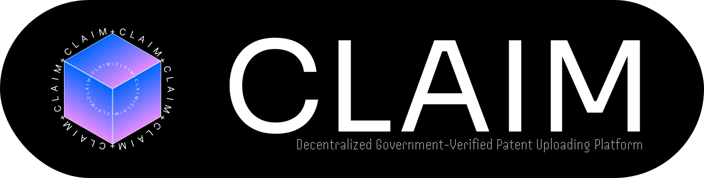

<!-- Centered Banner -->

  

<h1 align="center">NEXBIT</h1>

  <b>Innovating. Collaborating. Winning.</b> 
  🚀 A Group Of Students Developers Building The Tools Of The Future

---

<a href="https://nexbitx.vercel.app">Check Out Our Website</a>

---

## 🌟 About Us
We are a **hackathon-focused organization** passionate about building **innovative, real-world projects** under time constraints.  
Our team consists of developers skilled in **Web, Blockchain, AI/ML, Cybersecurity, and App Development**.  

- 🏆 **Projects Based On Hackathons**  
- 🤝 Open for collaboration & community projects  
- 🌐 Active across **Devpost, Unstop, and MLH events**  

---

## 🔥 Highlights

### **Our Focus**
- HACKATHONS
- CTF Challenges  
- Web Applications
- mobile applications
- Blockchain
---

## Projects
<table>
  <tr>
    <tr>
    <td>
       
    </td>
    <td>
     <h1>CLAIM(Prototype)</h1> 
      

social platform for uploading patents

    </td>
  <td>
     
    
  </td>
  </tr>
  <tr>
  <td>
      
  </td>
    <td>
      <h1>ESSENCE</h1>
      
AI Based Culture Learning

    </td>
    <td>
      </a>
  
  </td>
  </tr>
</table>

---

